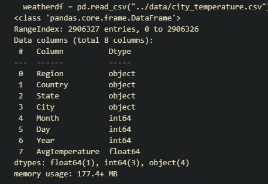

# **Energy Consumption Data Analysis and Forecast**

## Introduction

### Objective
The objective of this study is to explore the relationship between average temperature and energy consumption using data analysis and visualization techniques.

### Background
Changes in temperature can impact energy consumption patterns, particularly in sectors such as residential heating and cooling, industrial processes, and transportation. Understanding the relationship between temperature and energy consumption is essential for energy planning, resource management, and policy-making.

## Selection of Data

### Energy Consumption Dataset [Link](https://www.kaggle.com/datasets/robikscube/hourly-energy-consumption/data)
The dataset consists of hourly power consumption data, measured in megawatts (MW), obtained from PJM's website. These data reflect the energy usage patterns within the PJM region, which can vary based on factors such as time of day, seasonality,  and weather conditions.

* **Dataset Selection**

For the purpose of this study, we have selected the dataset corresponding to Dayton, Ohio. Dayton is a city located within the state of Ohio and is part of the PJM region. By focusing on the Dayton dataset, we aim to analyze the energy consumption patterns specific to this region and gain insights into factors influencing energy usage in this area.

* **Characterstics Of Dataset**

We have a 121275 samples spread across 2004-2018. We have 2 featues with DateTime which is an hourly record of power consumption in Megawatts. 

### Temperature Dataset [Link](https://www.kaggle.com/datasets/sudalairajkumar/daily-temperature-of-major-cities)

The weather data for major cities worldwide was sourced from Kaggle's dataset titled "Daily Temperature of Major Cities."

* **Dataset Selection** 

For this study, the data for Dayton, Ohio, was extracted from the larger dataset. It provides daily average temperature readings for Dayton, Ohio, from January 1, 2004, to December 31, 2018. The average temperature is recorded in degrees Fahrenheit and represents the mean temperature for each day.

* **Characterstics Of Dataset**

## Data Munging and Imputation

We specifically targeted the dataset to hone in on weather records related to Dayton, Ohio, United States, spanning from 2004 to 2018. By playing with boolean indexing tricks, we crafted conditions to snag precisely what we needed: City had to be 'Dayton', State needed to match 'Ohio', Country had to be 'US', and the Years had to fall between 2004 and 2018.

We aggregated the temperature data by year from our filtered dataset (filtered_df) to compute the mean temperature for each year. This resulted in a series containing the yearly average temperatures. To present this information in a more structured format, we converted the series into a DataFrame named yearly_avg_temp_df.

## Methods

Tools:
- pandas
- matplotlib
- numpy
- scikit-learn
- statsmodels

 Seasonal Decomposition using StatsModels

 - In this process, we utilized Seasonal-Trend Decomposition using LOESS (STL) to analyze the yearly energy consumption data stored in the 'DAYTON_MW' column of the DataFrame df_yearly_mean. By setting the seasonal period to 365 days, we aimed to capture annual seasonality patterns in energy consumption.

## Results

### **What are the overall trends in energy consumption over the past few years?**

 - It appears that both the mean and median power consumption experienced fluctuations throughout the years, with varying levels of intensity.
 - The observed dip in power consumption around 2008 reflects a notable shift in energy usage patterns, coinciding with the onset of the global financial crisis. Economic downturns often prompt businesses and industries to streamline operations and reduce energy-intensive activities, resulting in a decrease in overall energy demand
 -  By contextualizing historical energy consumption data within broader economic and policy contexts, we gain valuable insights into the dynamic interplay between external factors and energy usage trends over time.

### **Is there a seasonal pattern in energy consumption?**

 

 - Strong Seasonal Pattern: The seasonal-adjusted data appears as a straight line with very little variation, it implies that the seasonal component has been effectively removed from the original data. This could mean that the energy consumption exhibits a very predictable pattern over time, likely influenced by factors such as seasonal changes in weather, economic activity, or human behavior.

### **How does energy consumption vary with external factors such as temperature or economic indicators?**

- In this analysis, we sought to explore the relationship between average temperature and energy consumption in Dayton, Ohio, over the specified period.
- Utilizing linear regression, we trained a model to predict energy consumption based on average temperature. The resulting model was then used to generate predictions of energy consumption. 

- Overall, while the linear regression model can provide predictions of energy consumption based on temperature, the relatively low R-squared value and high error metrics suggest that the model's predictive capability is limited.

## Discussion
- The obtained results suggest limited explanatory power and predictive accuracy of the linear regression model using average temperature as a predictor for energy consumption in Dayton, Ohio.

- The low R-squared value and relatively high error metrics indicate that temperature alone may not sufficiently capture the variability in energy consumption patterns.

- Other factors beyond temperature, such as economic conditions, population dynamics, technological advancements, and policy interventions, likely play significant roles in influencing energy consumption trends.

- These findings align with previous research highlighting the multifaceted nature of energy demand drivers and the challenges in accurately modeling energy consumption patterns.

- Future research could explore incorporating additional explanatory variables beyond temperature, such as economic indicators, demographic characteristics, and energy policies, to improve predictive performance.

- Exploring nonlinear relationships and employing advanced modeling techniques, such as machine learning algorithms, may better capture the complex dynamics of energy consumption.

- Conducting comparative studies across different regions or time periods could provide valuable insights into the contextual factors shaping energy demand variability.

- Advancing our understanding of the determinants of energy consumption can inform more effective energy planning, policy-making, and sustainable development initiatives.